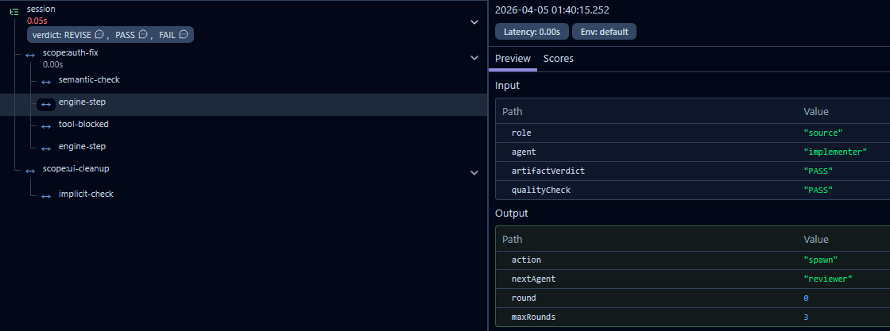

# claude-gates

Adversarial quality gates and pipelines for multi-agent orchestration. Your agents shall not pass without earning it.

<p align="center">
  <a href="https://code.claude.com/docs/en/plugins"></a>
  <a href="https://github.com/kam-l/claude-gates/actions/workflows/test.yml"></a>
  <a href="https://codecov.io/gh/kam-l/claude-gates"></a>
  <a href="https://github.com/kam-l/claude-gates/releases"></a>
</p>

<p align="center">
  <a href="#install">Install</a> ·
  <a href="#gates">Gates</a> ·
  <a href="#pipelines">Pipelines</a> ·
  <a href="#example">Example</a> ·
  <a href="#observability">Observability</a> ·
  <a href="CHANGELOG.md">Changelog</a>
</p>

```
● Updated plan
  ⎿  Error: [ClaudeGates] 🔐 "rippling-wandering-crane.md" (205 lines) unverified. Spawn
     claude-gates:gater with scope=verify-plan.

● claude-gates:gater(Verify plan via gater review)
  ⎿  Done (28 tool uses · 30.3k tokens · 3m 49s)
  (ctrl+o to expand)

  Read 1 file (ctrl+o to expand)

● Good catches from the gater. Let me address all findings in the plan.
```

<details>
<summary>Flame of Udûn</summary>

</details>

## Install

```bash
claude plugin marketplace add kam-l/claude-gates
claude plugin install claude-gates
```

Then run `/claude-gates:setup` — it checks dependencies, detects your stack, and walks you through every gate interactively.

Or just tell Claude: `Read https://github.com/kam-l/claude-gates/blob/master/INSTALL.md and install it.`

## Why This Exists

I tried the popular Claude Code harnesses. They're pure ceremony — elaborate prompts, rigid workflows, bloated skills — and zero enforcement. Your agent can ignore every "rule" because nothing actually stops it.

Then I created my own harness: wrote precise instructions, minimized context usage, bolded the requirements and enclosed them in `<critical>`... And agents still skipped creating their output files, because of course they did — LLMs are probabilistic, not deterministic.

**Prompts are suggestions. Hooks are enforcement.**

**ClaudeGates** moves quality control from "please do this" to "you literally cannot proceed without doing this". Every gate is a hook that fires at a deterministic moment in the agent lifecycle. No amount of prompt-following variance can bypass a `PreToolUse` block, that allows only what is required by pipeline.

## Gates

- Are togglable: write `gates off` or `gates on` to toggle
- All gates are **fail-open** — if something breaks, your work continues unblocked.
- All have **max retries** - default 2. 
- All are customizable by `/claude-gates:setup`. 

| Gate | Hook | What it does |
|------|------|-------------|
| **Plan** | `PreToolUse:ExitPlanMode` | Blocks unreviewed plans (>20 lines) until gater returns PASS. Auto-allows after 3 attempts. **Works by default, no setup needed.** |
| **Conditions** | `PreToolUse:Agent` | Gater evaluates spawn prompt against `conditions:` field. FAIL blocks the spawn - orchestrator must correct it and try spawning again. |
| **Verification** | `SubagentStop` | Subagent is forced to summarize its work in a file. Separate Sonnet agent then verifies this file. |
| **Pipeline** | `PreToolUse` | Sequential reviewers from `verification:` field. Each must PASS before the next runs. Orchestrator MUST spawn them in order. |


- **Hook-level enforcement** — gates are Claude Code hooks (`PreToolUse`, `SubagentStop`, `Stop`), not prompt instructions. They block tool calls via exit codes, not suggestions.
- **MCP sidecar** - state machine engine lives in MCP, safely separated from orchestrator who can't cheat his way through.
- **SQLite-backed state** — all pipeline state (verdicts, rounds, scopes, edits) lives in a per-session `session.db` backed by `better-sqlite3`. Atomic transactions, no file-locking races.
- **Scope-based isolation** — each pipeline gets a `scope=<name>`. Parallel pipelines in the same session run independently with no cross-talk.
- **Semantics first, structure later** — agents think freely with no output format constraints, until `SubagentStop` refocuses them to summarize their run in an output artifact.
- **Fail-open** — every hook catches errors and exits 0. If SQLite fails, if a script throws, if `claude -p` is unavailable — your work continues unblocked.
- **Declarative** — define what needs to happen in YAML frontmatter. The engine handles state transitions, retries, and routing.
- **Lightweight** — no large overhead, no multiple skills and commands which you don't use. Instead, enhance your subagents and create your pipelines, or just use default **Plan** gate.
- **[Tracing](#observability)** — optional. Every pipeline step, verdict, and retry as a **LangFuse** span. Unset the keys and it's a no-op.

## Pipelines

```yaml
# .claude/agents/implementer.md
---
name: implementer
conditions: |                                # Pre-spawn check
  Only spawn for authentication or data handling changes. 
verification:                                # Ordered pipeline steps
  - ["Does this show real implementation?"]  # Gater judges agent's output file
  - [cleaner!, 1]                            # Separate agent forced to follow this one
  - [reviewer?, 3]                           # Other agent verifies work so far - 3 rounds max
  - [tester?, 3, fixer!]                     # Another agent verifies and yet another fixes
  - [/commit, Bash]                          # Orchestrator must run command with allowed tools
---
```

Step types are inferred from the array shape:

| Pattern | Behavior |
|---------|----------|
| `["prompt text"]` | Checker (Sonnet via `claude -p`) evaluates agent output against the prompt |
| `[agent?, N]` | Spawn reviewer agent, up to N rounds |
| `[agent?, N, fixer!]`| If reviewer judges revision, pipeline routes to fixer agent  |
| `[/command, Tool1, Tool2]` | Orchestrator runs a slash command with allowed tools |
| `[agent!, 1]` | Agent that only does his part of the work, no review or revision. |

### Example

You tell Claude: *"Spawn implementer to refactor the auth middleware."*

Here's what the gate system does, step by step:

**1. Pre-spawn check** (`PreToolUse:Agent`)
The `conditions:` field says "Only spawn for authentication or data handling changes." A gater agent evaluates the prompt against this condition. Auth middleware qualifies — spawn allowed. If you'd asked for a CSS tweak, the spawn would be blocked and the orchestrator forced to adjust.
Scope is inferred from the current subject, eg. `auth-fix`.

**2. Agent works freely** (`SubagentStart` → agent runs)
The implementer gets no output format instructions. It just does the refactoring — reads code, edits files, thinks in whatever structure comes naturally.

**3. Artifact pivot** (`SubagentStop`, first fire)
The implementer finishes and tries to stop. SubagentStop intercepts: *"Your work is done. Write a thorough summary of your findings to `.sessions/{session_id}/auth-fix/implementer.md`."* The agent is forced to continue and write its summary. *Structure is requested only after free thinking is complete.*

**4. Semantic check** (`SubagentStop`, second fire)
The implementer stops again, now with an artifact on disk. A separate Sonnet checker reads the artifact and judges: *"Does this show real implementation?"* (the first `verification:` step). If the checker says REVISE — the implementer is told to re-run and update its artifact. If PASS — the pipeline advances.

**5. Reviewer gate** (`PreToolUse` blocks everything)
**All tools except spawning `reviewer` are now blocked.\*** The orchestrator must spawn it. The reviewer reads the implementer's artifact, cross-references the codebase, and writes its own verdict with `Result: PASS` or `Result: REVISE`.

\* With few exceptions: Read, Grep, Glob, TodoCreate, TodoUpdate, `/claude-gates:unblock`.

**6. Revision loop** (if REVISE)
REVISE routes either to the original agent (`implementer`) or to a dedicated `fixer`. It reads both the implementer's artifact and the reviewer's findings, produces corrections. The reviewer runs again on the updated work. This loops up to 3 rounds. If the reviewer's own review is sloppy, its own checker catches it and forces the reviewer to retry.

**7. Pipeline complete**
All steps pass. The block lifts. The orchestrator can continue with other work. The full audit trail (artifacts, review findings, semantic check results) is in `.sessions/{session_id}/`.

Throughout all of this, Claude (the orchestrator) never sees the gate machinery. It just sees tool calls being blocked with clear instructions on what to do next. The enforcement is invisible until you try to skip a step.

## Skills

| Skill | What it does |
|-------|-------------|
| `/claude-gates:setup` | Interactive setup — installs deps, explains each gate, creates sample agents |
| `/claude-gates:claude-gates` | Documentation and troubleshooting reference |
| `/claude-gates:unblock` | Clear database entries to unblock stuck pipeline |

## Architecture

```
hooks.json
  │
  ├─ SessionStart ──→ SessionCleanup.js (sweep old sessions)
  │                   npm install (better-sqlite3 into CLAUDE_PLUGIN_DATA)
  │
  ├─ PreToolUse ────→ PipelineBlock.js      (block tools while pipeline active)
  │                   PipelineConditions.js  (conditions: pre-spawn check, Agent)
  │                   PlanGate.js            (plan review, ExitPlanMode)
  │
  ├─ PostToolUse ───→ PlanGateClear.js     (clear plan gate, ExitPlanMode)
  │
  ├─ SubagentStart ─→ PipelineInjection.js  (pipeline creation + role context)
  │
  └─ SubagentStop ──→ PipelineVerification.js (verdict → state machine)

Engine: PipelineEngine.ts ─── state machine, owns ALL transitions via step()
State:  PipelineRepository.ts ─ SQLite tables: pipeline_state, pipeline_steps,
                                 agents, edits, tool_history
Gates:  GateRepository.ts ─── plan-gate attempts + MCP verdict storage
```

TypeScript source in `src/`, compiled to `scripts/`. 126 unit tests + 28 end-to-end tests. See [ARCHITECTURE.md](ARCHITECTURE.md) for the full design and [CHANGELOG.md](CHANGELOG.md) for version history.

## Performance

Benchmarks on the pipeline engine (1,000 iterations, SQLite WAL mode):

| Benchmark | Per op | Ops/sec |
|-----------|--------|---------|
| Pipeline creation (3 steps) | 0.24 ms | 4,117 |
| State transition (step → PASS) | 0.98 ms | 1,024 |
| DB read (getPipelineState) | 0.03 ms | 31,178 |
| DB write (setVerdict) | 0.04 ms | 24,148 |
| Concurrent isolation (10 pipelines) | 9.76 ms | 102 |

Run `node scripts/benchmark.js` to reproduce.

## Observability

ClaudeGates writes a local `audit.jsonl` trace to each `.sessions/{session_id}/` directory — every state transition, verdict, and retry is logged with timestamps.

For remote observability, set three environment variables to enable [LangFuse](https://langfuse.com) tracing:

```bash
LANGFUSE_PUBLIC_KEY=pk-lf-...
LANGFUSE_SECRET_KEY=sk-lf-...
LANGFUSE_BASE_URL=https://cloud.langfuse.com   # optional, defaults to cloud
```

When set, every session gets a single Langfuse trace with scope-level spans and categorical verdict scores. When unset, tracing is a no-op — no errors, no overhead.



```
session                              # one trace per Claude Code session
  ├─ scope:auth-fix                  # one span per pipeline scope
  │    ├─ semantic-check             # { prompt, agent, artifactPath, artifactSize } → { verdict, reason }
  │    ├─ engine-step                # { role, agent, artifactVerdict, qualityCheck } → { action, nextAgent, round, maxRounds }
  │    ├─ tool-blocked               # { toolName, scope, expectedAgent }
  │    └─ engine-step                # verifier/fixer/transformer transitions
  ├─ scope:ui-cleanup                # parallel pipelines traced independently
  │    └─ implicit-check             # structural validation failure
  └─ scores: verdict (PASS|FAIL|REVISE)   # categorical, one per verdict event
```

## Configuration

Run `/claude-gates:setup` to configure all interactively.

## Testing

```bash
node scripts/PipelineTest.js           # 126 unit/integration tests
node scripts/PipelineE2eTest.js       # 28 end-to-end tests
```

## License

MIT
